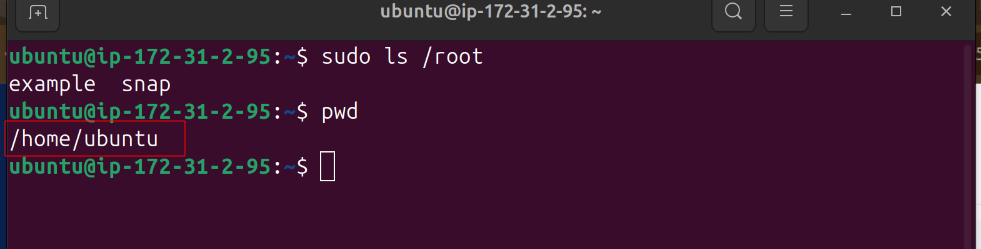

# Basic-Linux-Commands
## This project Demonstrates Baslic Linux Commands

### Linux commands are utilities of the Linux OS. All tasks in Linux can be accomplished by executing commands through the Linux terminal. Let's connect to the EC2 instance.

* Navigate to the host directory of the .pem file and connect through ssh

`ssh -l "linux-mini-project.pem" username@<ip address>.zone.compute.amazonaws.com`

## Make a directory in the root.

### To create a directory use _mkdir_ command to create a dir name example in the root directory

* `mkdir /root/example`

### The *_mkdir_* command returned permision denied. This is because the operation is to carried out on the root folder and requires a super user. Super user do *'sudo'* has to prefix the command. This elevates the current user account to have root privileges.

* Run `sudo mkdir /root/example`

### To verify that the folder has the created,we use the **_ls_** to view folder content

* Run `sudo ls /root`

### Example folder was created as desired as shown above.

### Print Working Directory *'pwd'* command. This  writes the full pathname of the current working directory to the standard output.

* On the terminal run `pwd`

### The root *("/")* directory is the first or top-most directory in a hierarchy

### /bin contains user command binaries for all users both the sysadmin and other users and has no sub directories. Binaries contained in /bin include commands like ls, cp, mv, mkdir, rm etc. 

### /etc directory is a special folder in Linux that holds system-wide configuration files. These files tell your system how to behave, from setting up your network to managing user accounts. 

### /home directory is a directory that is assigned to each user account on a Linux system. It is the directory where a user's personal files and settings are stored.

### /var is a standard directory that stands for "variable files". As the name suggests, this directory contains data that changes frequently while the system is running.

### /usr file system contains executable files that can be shared among machines and user utilities.

* Run `tree -L1` to view some of the root directory contents we talked about. The _L1_ flag means show level 1

* Run `sudo cd /` to switch to root dir. Them run `pwd` to you are in the root directory.

* Runs `ls -l` to long list the contects of the root directory.

### `ls -l` is a long listing format that dispalys detailed information about files and directories(permissions, owner, group, size, modification time etc.)

### Notice the total number of items in the root (total 76)

* Run `ls -la` and compare the output.

### The difference is that _ls -la_ is flaged with a _-l_  (detailed listing) and _-a_ (show all files, including hidden ones). This is the reason why total is now 84 as compaired to total 76 from the previous command.

### Let us explore some other commands and directories.

* Run `sudo cd /usr` to change working directory to usr.

### Make a child directory named photos inside usr

* Run `mkdir photos`

### Permission denied because we ommited the super user do prefix

* Run `sudo mkdir photos`
* Run `cd photos`
* Run `sudo mkdir photo1 photo2 photo3`

* Rus `ls` to verify the folders created in the last command

