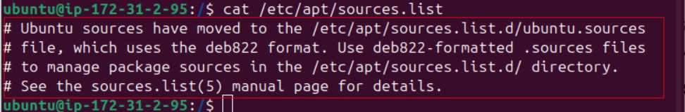
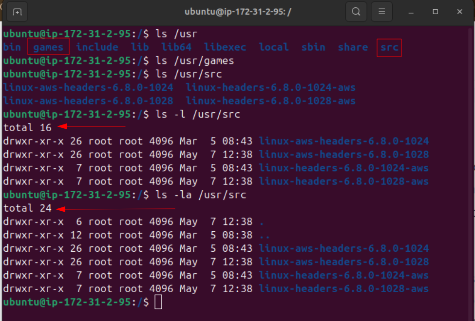
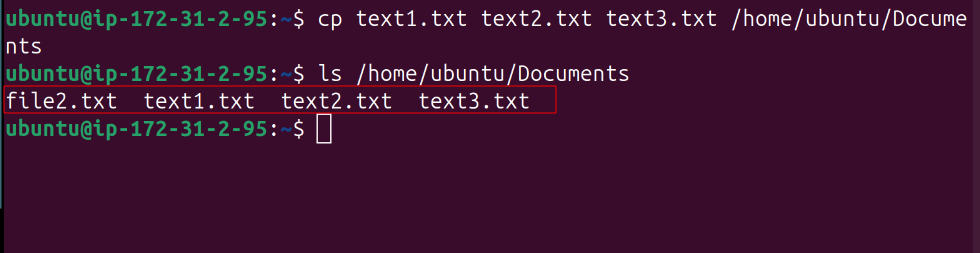

# Basic-Linux-Commands.
## This project Demonstrates Baslic Linux Commands.

### Linux commands are utilities of the Linux OS. All tasks in Linux can be accomplished by executing commands through the Linux terminal. Let's connect to the EC2 instance.

* Navigate to the host directory of the .pem file and connect through ssh

`ssh -l "linux-mini-project.pem" username@<ip address>.zone.compute.amazonaws.com`

## Make a directory in the root.

### To create a directory use _mkdir_ command to create a dir name example in the root directory

* `mkdir /root/example`

### The *_mkdir_* command returned permision denied. This is because the operation is to carried out on the root directory and requires a super user. Super user do *'sudo'* has to prefix the command. This elevates the current user account to have root privileges.

* Run `sudo mkdir /root/example`

### To verify that the directory has the created,we use the **_ls_** to view directory content

* Run `sudo ls /root`

### Example directory was created as desired as shown above.

### Print Working Directory *'pwd'* command. This  writes the full pathname of the current working directory to the standard output.

* On the terminal run `pwd` switch to /home/ubuntu `cd /home/ubuntu` run `pwd` again to see that you have moved from root to home/ubuntu which is your username.

### The root *("/")* directory is the first or top-most directory in a hierarchy

### /bin contains user command binaries for all users both the sysadmin and other users and has no sub directories. Binaries contained in /bin include commands like ls, cp, mv, mkdir, rm etc. 

* Run `ls /bin` to list the bin directory

* Run `cd /bin` to switch to bin directory

### /etc directory is a special directory in Linux that holds system-wide configuration files. These files tell your system how to behave, from setting up your network to managing user accounts. 
* Run `ls /etc` to list etc directory contents

* Run `cat /etc/apt/sources.list` to view content of a file named sources.list residing in the apt directory which is a subdirectory it etc directory

### /home directory is a directory that is assigned to each user account on a Linux system. It is the directory where a user's personal files and settings are stored.

* Check our current directory and switch to home directory if not already
* Run `pwd` if not in home directory then run `cd /home/ubuntu` ubuntu here is the username.

### /var is a standard directory that stands for "variable files". As the name suggests, this directory contains data that changes frequently while the system is running.

* Run `ls /var` to list contents. Go further to view content of backups directory inside var directory. Run `ls /var/backups`

### /usr file system contains executable files that can be shared among machines and user utilities.

* Run `ls /usr` to list contents of usr directory.

* Run `tree -L1` to view some of the root directory contents we talked about. The _L1_ flag means show level 1

* Run `sudo cd /` to switch to root dir. Them run `pwd` to you are in the root directory.

* Runs `ls -l` to long list the contects of the root directory.

### `ls -l` is a long listing format that dispalys detailed information about files and directories(permissions, owner, group, size, modification time etc.)

### Notice the total number of items in the root (total 76)

* Run `ls -la` and compare the output.

### The difference is that _ls -la_ is flaged with a _-l_  (detailed listing) and _-a_ (show all files, including hidden ones). This is the reason why total is now 84 as compaired to total 76 from the previous command.

### Let us explore some other commands and directories.

* Run `sudo cd /usr` to change working directory to usr.

### Make a child directory named photos inside usr

* Run `mkdir photos`

### Permission denied because we ommited the super user do prefix

* Run `sudo mkdir photos`
* Run `cd photos`
* Run `sudo mkdir photo1 photo2 photo3`

* Run `ls` to verify the folders created in the last command

### Navifgate to first sub-directory in photos directory

* Run `cd photo1` and `pwd` to verify the working directory

### Navifgate to second sub-directory in photos directory

* Run `cd ..` to back one step into photos directory then run `cd photo2` and `pwd` to verify the working directory.

### Navifgate to third sub-directory in photos directory

* Run `cd ..` to back one step into photos directory then run `cd photo3` and `pwd` to verify the working directory.

### _ls_ command.
### The ls command is used to display the files and directories or path in the terminal. The _ls_ command has options that allow users to customize the output.

* Run `ls /home/ubuntu/Documents` to list all files and folders in the Documents directory.

### Some options or flags for _ls_ command includes:
* Run `ls -R` to list all files in the sub folder.

### ls -R lists all the files in the subdirectories.
* Run `ls -R` to show all files, hidden files inclusive.

### ls -lh shows the file sizes in easily readable formats, such as MB, GB, and TB.

* Run `ls -lh` to show file sizes in human readable format.

### Cat Command

### The cat command in Linux is more than just a simple tool, it’s a versatile companion for various file-related operations, allowing users to view, concatenate, create, copy, merge, and manipulate file contents.

* Run `sudo cat /etc/os-release` to view the OS details

### Add content to a file using `echo` command so we can `cat` to see the contents

* Run `echo 'coping my files' > text1.txt` This will write the sentence in single quote into a file named text1.txt. If this file does not exist, it will be created.

### cp Command
### The `cp` command is an essential tool which is used for copying files or groups of files and directories.

* Run `cp file2.txt /home/ubuntu/Documents` to copy the file.

* Run `ls /home/ubuntu/Documents` to verify the _cp_ command.

### To copy multiple files at once.

* Run `cp text1.txt text2.txt text3.txt /home/ubuntu/Documents` Then list the directory to confirm.

### Copy contents of one file to another

* Run `cp text1.txt text4.txt` to copy the contents of text1.txt to text4.txt. Run `cat text4.txt` to verify the cp command.

### To copy entire directory, run the _cp_ command with a _-R_ flag

* Run `cp -R /home/ubuntu/Documents /home/ubuntu/Documents_backup`

### `mv` command, primarily used to movr snd rename files and directories.

* Run `mv file3.txt /home/ubuntu/Documents` This command moves file3.txt to user Document directory, in this case 'ubuntu'. List the directory to very the file has been moved.

### We can also use the _mv_ command to rename a file.

* Run `mv file2.txt newfile2.txt`, list the directory to confirm.

### `rm` command is used to delete files within a directories.

* Run `rm newfile2.txt` to delete newfile2.txt, then list the directory to confirm newfile2.txt delete.

### We also delete multiple files with the _rm_ command.

* run `rm text2.txt text3.txt text4.txt` to delete all three files at once.

### There are options(flags) that you can use with the _rm_ command

* rm -i will prompt you to confirm before deleting the file. Run `rm -i /home/ubuntu/Documents/file2.txt` then type _yes_ to complete the **delete** operation

* rm -f will delete a file without asking for confirmation. the _-f_ flag means _force_. Run `rm -f /home/ubuntu/Documents/file3.txt` to delete file3.txt.

* rm -r will recursively delete a directory and all its contents (normally rm will not delete directories). Run `rm -r project` to delete the project directory.

### Touch command enables users to create an empty file.

* Run `touch /home/ubuntu/Documents/web.html`

### Find command is used to search for files within specified directory.

* Run `find /home -name web.html` to find a file named web.html in the home directory.

## Hope you followed through and this have been informative for you.
